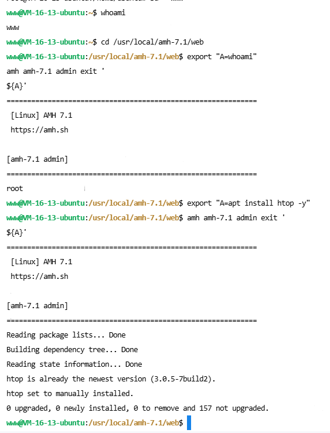

# AMH <= 7.1 命令行注入漏洞

本来不准备发的，但奈何作者脸皮实在太厚，不得不发。

## 漏洞描述

AMH <= 7.1 版本的 amh.c 中对用户输入的参数过滤不完整，导致了命令注入漏洞。

具体为 41 行的

```c
if (cmd_row[i] == ' ' || cmd_row[i] == '`' || cmd_row[i] == ';' || cmd_row[i] == '&' || cmd_row[i] == '|' || cmd_row[i] == '(') cmd_row[i] = '_';
```

这里只过滤了空格、反引号、分号、与、或、括号，但是没有过滤换行符，导致了命令注入漏洞。

通过这个漏洞，我们轻易可以提权到 root 用户执行任意命令。

## 漏洞利用



## 修复建议

作者已经在 7.2 版本中修复了这个漏洞，建议尽快升级到 7.2 版本。

除此漏洞之外，AMH 还存在多处设计缺陷和低危漏洞，个人建议不要在正式生产环境中使用。

## 参考链接

[https://hostloc.com/thread-1362317-1-1.html](https://hostloc.com/thread-1362317-1-1.html)
[https://hostloc.com/thread-1356303-1-1.html](https://hostloc.com/thread-1356303-1-1.html)

## LICENSE

WTFPL
